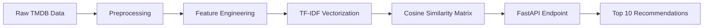

<p align="center">
  <h1 align="center">🎬 CineMatch — Movie Recommender System</h1>
  <p align="center">
    A full-stack, content-based movie recommendation engine powered by NLP and cosine similarity.
    <br />
    <a href="http://54.81.20.171:8000/"><strong>🌐 Live Demo »</strong></a>
    &nbsp;&nbsp;·&nbsp;&nbsp;
    <a href="http://54.81.20.171:8000/docs"><strong>📖 API Docs »</strong></a>
  </p>
</p>

---

## 📌 Overview

CineMatch analyzes movie metadata — genres, keywords, cast, crew, and plot overviews — to build a content fingerprint for every film in the dataset.  When a user selects a movie, the engine instantly retrieves the **10 most similar titles** by comparing these fingerprints using cosine similarity.

The project ships as a **self-contained Docker image** that serves both the React frontend and the FastAPI backend from a single container, deployed on **AWS EC2**.

---

## ✨ Key Features

| Feature | Description |
|---------|-------------|
| 🤖 **AI Recommendations** | TF-IDF vectorization + cosine similarity over 4,800+ movies |
| ⚡ **FastAPI Backend** | Production-ready REST API with health checks & structured logging |
| 🎨 **React Frontend** | Dark-themed SPA with search, trending suggestions, and an interactive movie quiz |
| 🐳 **Dockerized** | Single-command deployment with `docker run` |
| ☁️ **AWS Deployed** | Running live on EC2 at [54.81.20.171:8000](http://54.81.20.171:8000/) |
| 📦 **Poetry** | Modern, reproducible dependency management |

---

## 🏗️ Architecture

```
┌─────────────────────────────────────────────────┐
│                   Docker Container              │
│                                                 │
│  ┌──────────────┐       ┌────────────────────┐  │
│  │   Frontend    │       │    FastAPI Backend  │  │
│  │  (React SPA)  │◄─────►│                    │  │
│  │  index.html   │ CORS  │  /predict          │  │
│  └──────────────┘       │  /quiz-recommend    │  │
│                          │  /health            │  │
│                          │                    │  │
│                          │  ┌──────────────┐  │  │
│                          │  │ cosine_sim   │  │  │
│                          │  │ .pkl matrix  │  │  │
│                          │  └──────────────┘  │  │
│                          └────────────────────┘  │
└─────────────────────────────────────────────────┘
```

---

## 📂 Project Structure

```
Movie-Recommender-System/
├── backend/
│   └── api.py                 # FastAPI application (endpoints, model loading, CORS)
├── frontend/
│   └── index.html             # React SPA (search, quiz, recommendations UI)
├── notebooks/
│   └── Movies_Recommender_Sysytem.ipynb   # EDA, feature engineering, model training
├── data/
│   ├── tmdb_5000_credits.zip  # Raw credits dataset
│   └── tmdb_5000_movies.zip   # Raw movies dataset
├── cosine_sim.zip             # Pre-computed similarity matrix (compressed)
├── movies.csv                 # Processed movie dataset used by the API
├── Dockerfile                 # Container configuration
├── pyproject.toml             # Poetry dependencies
├── poetry.lock                # Locked dependency versions
└── README.md
```

---

## 🧠 How It Works



1. **Preprocessing** — Merge credits and movies datasets, handle missing values, extract nested JSON fields (genres, cast, crew, keywords).
2. **Feature Engineering** — Combine overview, genres, keywords, cast, and director into a single `tags` column. Apply stemming and lowercasing.
3. **Vectorization** — Convert the `tags` column into numerical vectors using **TF-IDF Vectorizer** from scikit-learn.
4. **Similarity Matrix** — Compute a 4,803 × 4,803 **cosine similarity** matrix. Each cell represents the content similarity between two movies.
5. **Serving** — At runtime, look up the movie's row in the matrix, sort by similarity score, and return the top 10 matches.

---

## 🧰 Tech Stack

| Layer | Technology |
|-------|------------|
| **Language** | Python 3.11+ |
| **Backend** | FastAPI, Uvicorn, Pydantic |
| **Frontend** | React 18, Babel (in-browser JSX), Vanilla CSS |
| **ML / NLP** | Scikit-learn (TF-IDF, Cosine Similarity), Pandas, NumPy |
| **Deployment** | Docker, AWS EC2 |
| **Dependencies** | Poetry |

---

## 🚀 Getting Started

### Prerequisites

- **Python 3.11+** and [Poetry](https://python-poetry.org/docs/#installation), **or**
- **Docker**

### Option 1 — Local Development (Poetry)

```bash
# Clone the repo
git clone https://github.com/Omar-Mahrous-am/Movie-Recommender-System.git
cd Movie-Recommender-System

# Install dependencies
poetry install

# Start the server
poetry run uvicorn backend.api:app --reload
```

Open [http://localhost:8000](http://localhost:8000) in your browser.

### Option 2 — Docker

```bash
# Build the image
docker build -t movie-recommender .

# Run the container
docker run -d -p 8000:8000 --name cinematch movie-recommender
```

Open [http://localhost:8000](http://localhost:8000) in your browser.

---

## 🔌 API Reference

Base URL: `http://54.81.20.171:8000`

| Method | Endpoint | Description |
|--------|----------|-------------|
| `GET` | `/health` | Health check — returns model loading status |
| `POST` | `/predict` | Get 10 movie recommendations for a given title |
| `POST` | `/quiz-recommend` | Quiz-based recommendations (accepts genre & era preferences) |

### `POST /predict`

**Request:**
```json
{
  "title": "The Dark Knight"
}
```

**Response:**
```json
{
  "requested_movie": "The Dark Knight",
  "recommendations": [
    "The Dark Knight Rises",
    "Batman Begins",
    "Batman",
    "Batman Returns",
    "Batman Forever",
    "Batman & Robin",
    "Batman: Under the Red Hood",
    "The Prestige",
    "Inception",
    "Iron Man"
  ]
}
```

### `GET /health`

**Response:**
```json
{
  "status": "healthy",
  "model_loaded": true,
  "error": null
}
```

> 💡 Interactive API docs are available at [`/docs`](http://54.81.20.171:8000/docs) (Swagger UI) and [`/redoc`](http://54.81.20.171:8000/redoc) (ReDoc).

---

## 📂 Dataset

- **Source:** [TMDB 5000 Movie Dataset](https://www.kaggle.com/datasets/tmdb/tmdb-movie-metadata) on Kaggle
- **Size:** 4,803 movies with metadata including title, overview, genres, keywords, cast, and crew
- **Processing:** See the [notebook](notebooks/Movies_Recommender_Sysytem.ipynb) for the full data pipeline

---

## 🤝 Contributing

1. Fork the repository
2. Create your feature branch (`git checkout -b feature/amazing-feature`)
3. Commit your changes (`git commit -m 'Add amazing feature'`)
4. Push to the branch (`git push origin feature/amazing-feature`)
5. Open a Pull Request

---

## 📄 License

This project is licensed under the MIT License.

---

<p align="center">
  Built with ❤️ by <a href="https://github.com/Omar-Mahrous-am">Omar Mahrous</a>
</p>
